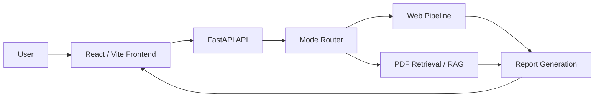

# AI Research Report Generator

AI Research Report Generator is a full-stack multi-agent research workspace that produces grounded reports from web sources, uploaded PDFs, or a hybrid of both. The backend exposes a FastAPI service for orchestration, retrieval, and report generation, while the frontend provides a React UI for the end-to-end workflow.

## Overview

The system routes each request through a multi-step pipeline that plans the query, gathers evidence, analyzes sources, writes the report, and returns structured progress metadata. It is designed for local development today, but the codebase is organized so the backend API and frontend client can be deployed independently.

## Capabilities

- Web research mode for live internet-backed reports.
- PDF RAG mode for grounded answers from uploaded documents.
- Hybrid mode that combines PDF evidence with web research.
- Structured progress tracking for each agent stage.
- FastAPI OpenAPI documentation and health checks.
- Vite-based frontend with configurable API base URL.

## Architecture



## Repository Layout

- `backend/` contains the FastAPI application, routing, orchestration, and retrieval services.
- `frontend/` contains the React UI and API client.
- `backend/storage/` holds runtime data such as the Chroma vector store and uploaded PDFs.
- `.env` stores local secrets and configuration.

## Prerequisites

- Python 3.10 or newer.
- Node.js 18 or newer.
- A Tavily API key for web search.
- A Mistral API key for the language model provider used by the agent pipeline.

## Configuration

Create a root-level `.env` file with the backend settings:

```text
TAVILY_API_KEY=your_tavily_api_key
MISTRAL_API_KEY=your_mistral_api_key
FRONTEND_ORIGINS=http://localhost:5173,http://127.0.0.1:5173
```

Optional frontend configuration goes in `frontend/.env`:

```text
VITE_API_BASE_URL=http://127.0.0.1:8000
```

## Local Setup

### Backend

From the project root:

```powershell
.\.venv\Scripts\activate
pip install -r backend\requirements.txt
```

If you prefer a fresh virtual environment, create one first and then install the backend dependencies.

### Frontend

```powershell
cd frontend
npm install
```

## Running the Application

Start the backend:

```powershell
uvicorn backend.main:app --reload --host 127.0.0.1 --port 8000
```

Start the frontend in a second terminal:

```powershell
cd frontend
npm run dev
```

If you need a fixed alternate port:

```powershell
npm run dev -- --host 127.0.0.1 --port 5181 --strictPort
```

Frontend URL:

```text
http://127.0.0.1:5173
```

API docs:

```text
http://127.0.0.1:8000/docs
```

## API Endpoints

- `GET /` returns a simple service status payload.
- `GET /health` returns a health check response.
- `POST /api/research/upload-pdf` uploads and indexes a PDF.
- `POST /api/research/generate` generates a report for the requested mode.

### Example: Generate a Web Report

```json
{
  "topic": "Latest trends in agentic AI systems",
  "mode": "web"
}
```

### Example: Generate a PDF Report

```json
{
  "topic": "Summarize the financial risks in the uploaded PDF",
  "mode": "pdf",
  "document_id": "returned-document-id"
}
```

## PDF Workflow

1. Select `PDF RAG` or `Hybrid` in the UI.
2. Upload a PDF.
3. Wait for the document to be indexed.
4. Enter a topic.
5. Generate the report.

For PDF and Hybrid modes, the frontend uploads the file first and then sends the returned `document_id` to the report generation endpoint.

## Production Notes

- Set `FRONTEND_ORIGINS` to the exact production frontend origin(s) before exposing the API publicly.
- Point `VITE_API_BASE_URL` to the deployed backend URL when the frontend is not served from the same origin.
- Keep local secrets, vector store files, uploaded PDFs, and other generated artifacts out of version control.
- The repository now includes a `.gitignore` tailored for Python, Node, and runtime data produced by the app.

